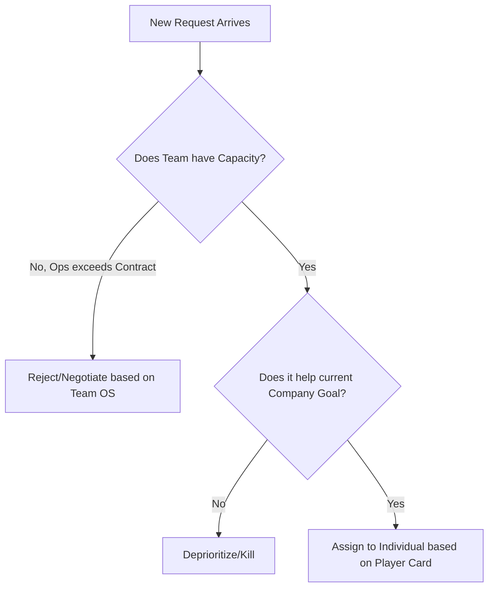

# Manager Decision Protocol

> **Layer:** KERNEL  
> **Owner:** [Your Name]  
> **Version:** 2026.02  
> **Last Updated:** [YYYY-MM-DD]  
> **Portable:** Yes

---

## What Is This File?

**Decision Protocol** is your conflict resolution logic — how you choose between competing priorities when they clash. It defines the 3-gate hierarchy (Capacity → Strategy → Individual Match) and enforcement rules.

This file is used when:
- Handling `stakeholder_request` — which new work to accept
- Running `escalate` — how to resolve conflicts
- Planning `prep_planning` — prioritizing backlog

**Update frequency:** Rarely (foundational; built during SETUP_WIZARD)  
**Used by:** `stakeholder_request`, `escalate`, `prep_planning`  
**Core concept:** Rule Zero ("When in doubt, talk in person") + 3-gate hierarchy

---

**Purpose:** To resolve conflicts and guide execution using the Manager Operating System (MOS) files.

## 0. Rule Zero: The Human Handshake (Default to Speak)

* **Principle:** This OS is a *decision-support* tool, not a decision-maker. It calculates trade-offs, but humans make the call.
* **The Trigger:** If the rules below result in a logical conflict, ambiguity, or a "bad gut feeling," the system halts.
* **The Action:**
    1. Stop the async/logic flow.
    2. **Speak:** Schedule a synchronous conversation.
    3. **Goal:** Use the OS outputs (Pros/Cons) as the agenda, but decide face-to-face.
* **Override Authority:** Any human can invoke Rule Zero at any time. It cannot be overridden by any other rule.

---

## 1. The Hierarchy of Precedence (Order of Operations)

When making a decision, apply constraints in this specific order (Local $\rightarrow$ Global):

1. **Level 1: The Team Contract (Local Context)**
    * *Why?* The team is the execution unit. Their immediate health and capacity determine *if* we can work.
    * *Rule:* If a request violates the team's **Capacity Contract** (defined in Team OS), it is blocked, regardless of Company priority (unless P0).
2. **Level 2: Company Strategy (Global Direction)**
    * *Why?* If the Team has capacity, we must align with the Company.
    * *Rule:* Choose the path that maximizes the **Company Strategy**.
3. **Level 3: Individual Needs (Personal Context)**
    * *Why?* Long-term sustainability requires individual growth.
    * *Rule:* Match the task to the person's **"Player Card"** (Strengths/Goals).

## 2. Interaction Rules (The API)

### Rule A: The "Override" Function

* **Scenario:** Company Value says "Move Fast," but Team Value says "Reliability First."
* **Logic:** The **Team OS** overrides the Company OS for *implementation details*.
  * *Result:* We move fast on *features*, but we do not compromise *quality gates*.

### Rule B: The "Conflict" Function

* **Scenario:** Two roadmap items compete for the same resource.
* **Logic:**
    1. Check **Company Strategy**: Which item impacts the current Company Goal more?
    2. Check **Team OS**: Does one item reduce "Hidden Factory" (ops) work?
    3. **Decision:** Prioritize the intersection of High Impact + Debt Reduction.

### Rule C: The "Exception" Function

* **Scenario:** A P0 Incident (System Down).
* **Logic:** **Suspend all MOS Rules.**
  * Switch to **Commanding Leadership** (MOS §5).
  * Ignore Capacity Contract Split.
  * Restore standard rules immediately after resolution.

## 3. Execution Loops

### The "New Task" Loop

## 4. Decision Speed (Reversibility Check)

* **Reversible Decisions:** Make them fast. Don't ask for permission. Bias toward action.
* **Irreversible Decisions:** Require a Spec and sign-off. If in doubt, invoke Rule Zero.
