# Architecture — Manager Operating System (MOS)

**For new managers:** This document shows visually how the MOS works—the layers, how they connect, how data flows, and when each layer is consulted.

---

## 1. Layer Hierarchy & Information Flow

This shows how the OS is structured and how information flows from your setup through daily execution.

```mermaid
%%{init: {'theme':'dark'}}%%
graph TD
    A["📖 00_BOOT<br/>System Manual & Onboarding"] --> B["⚙️ 01_KERNEL<br/>Your Portable Philosophy"]
    B --> C["🏢 02_CONFIG<br/>Company Context"]
    C --> D["👥 03_DRIVERS<br/>Team Specifics"]
    D --> E["📅 04_PROCESSES<br/>Current Roadmap"]
    E --> F["🎮 05_COMMANDS<br/>AI Interface Layer"]
    F --> G["🧠 06_BOARDROOM<br/>Virtual Advisory Council"]
    G -.->|executes| H["AI Copilot<br/>ChatGPT / Gemini"]
    F -.->|executes| H
    
    style A fill:#404040
    style B fill:#404040
    style C fill:#404040
    style D fill:#404040
    style E fill:#404040
    style F fill:#404040
    style G fill:#404040
    style H fill:#404040
```



**What each layer does:**
- **00_BOOT** — Teaches you the system (you read this once)
- **01_KERNEL** — Your personal leadership DNA (permanent, portable)
- **02_CONFIG** — Your company's mission and strategy (changes when company changes)
- **03_DRIVERS** — Your current team setup (changes when team changes)
- **04_PROCESSES** — Your current quarter's plan (changes every quarter)
- **05_COMMANDS** — The operations that glue everything together via AI
- **06_BOARDROOM** — Your virtual advisory council (permanent, portable — personas travel with you)

---

## 2. Complete System Graph — Files, Commands & Data Sources

This shows how all the pieces connect: which files feed into which commands, and where external data comes from.

```mermaid
%%{init: {'theme':'dark'}}%%
graph LR
    subgraph Kernel["🔷 KERNEL (Portable - travels with you)"]
        K1["Manager OS<br/>Philosophy & Values"]
        K2["Decision Protocol<br/>Trade-off Rules"]
        K3["Personal DNA<br/>Goals & Patterns"]
    end
    
    subgraph Config["🔶 CONFIG (Company-level)"]
        C1["Company OS<br/>Mission & Values"]
        C2["Company Strategy<br/>North Star Goal"]
    end
    
    subgraph Drivers["🟢 DRIVERS (Team-level)"]
        D1["Team OS<br/>Squad, Capacity<br/>& Partner Teams"]
        D2["Player Cards<br/>Individual Specs"]
    end
    
    subgraph Processes["🔴 PROCESSES (Quarterly)"]
        P1["Tactical Plan<br/>Roadmap & Risks"]
    end
    
    subgraph Commands["⚫ COMMANDS (AI Operations)"]
        CMD1["init_week<br/>Plan week"]
        CMD2["init_day<br/>Plan day"]
        CMD3["prep_121<br/>1:1 prep"]
        CMD4["stakeholder_request<br/>Decision gate"]
        CMD5["capacity_check<br/>Load check"]
        CMD6["escalate<br/>Hierarchy"]
        CMD7["boardroom<br/>Advisory council"]
    end
    
    subgraph Boardroom["🧠 BOARDROOM (Portable - travels with you)"]
        B1["Boardroom<br/>Personas & Principles"]
    end
    
    subgraph External["🌐 DATA SOURCES (External Tools)"]
        EXT1["Tasks & Issues</br> (Ex. Jira)"]
        EXT2["Roadmap & Strategy</br> (Ex. Airtable)"]
        EXT3["Comms</br> (Ex. Slack)"]
    end
    
    K1 --> CMD1
    K2 --> CMD4
    K3 --> CMD3
    C2 --> CMD1
    D1 --> CMD5
    D2 --> CMD3
    P1 --> CMD2
    B1 --> CMD7
    
    CMD1 -.->|queries| EXT1
    CMD1 -.->|queries| EXT2
    CMD4 -.->|queries| EXT1
    CMD5 -.->|queries| EXT1
    CMD3 -.->|references| EXT3
    
    style Kernel fill:#404040,stroke:#ff9800,stroke-width:3px
    style Config fill:#404040,stroke:#9c27b0,stroke-width:3px
    style Drivers fill:#404040,stroke:#4caf50,stroke-width:3px
    style Processes fill:#404040,stroke:#e91e63,stroke-width:3px
    style Commands fill:#404040,stroke:#333,stroke-width:2px
    style External fill:#404040,stroke:#009688,stroke-width:2px
    style Boardroom fill:#404040,stroke:#2196f3,stroke-width:3px
```



**Key insight:** 
- **Solid arrows** = files read at setup time
- **Dotted arrows** = commands query external data on-demand
- **Each command** pulls context from multiple layers, then asks for live data to fill gaps

---

## 3. Lifecycle — When Each Layer Is Active

This shows what happens during a typical week, and which layers you consult at each stage.


---

## 4. Command Execution Details — What Each Command Reads & Asks For

This table shows the logic: what context does each command read, what data does it request, and what does it output?

| Command | Reads from | Asks You For | Queries | Output |
|---------|-----------|--------------|---------|--------|
| `init_week` | KERNEL §8,9,12 + CONFIG §1 + DRIVERS §2,4,6,7 | Team availability, blockers | Jira sprint | Weekly plan + focus areas |
| `init_day` | PROCESSES §1 | Daily priorities | Jira board | Daily focus list + priorities |
| `shutdown_day` | PROCESSES §1 + KERNEL §12 | Actual progress, blockers | — | Progress recap + patterns |
| `shutdown_week` | PROCESSES §1 + KERNEL §12 | Week recap | Jira burndown | Week summary + learnings |
| `prep_121 [name]` | KERNEL §2,5,6 + DRIVERS player card | Recent observations | — | 1:1 agenda + feedback prep |
| `onboard [name]` | KERNEL §1,2 + DRIVERS team norms | New hire info | — | Onboarding checklist |
| `prep_planning` | KERNEL §10 + DRIVERS §3,4 | Draft goals | Airtable roadmap | Planning framework + review |
| `capacity_check` | DRIVERS §2,4,7 + KERNEL §3 | Sprint metrics | Jira | Capacity analysis + breach flags |
| `retro` | KERNEL §1,7 + DRIVERS §5 | Retrospective notes | — | Retro facilitator guide |
| `stakeholder_request [desc]` | KERNEL §3 + DRIVERS §2,4,7 + PROCESSES §1 | Effort, requestor | Jira + Airtable | Decision + script for "no" |
| `escalate` | KERNEL §3,8 + DRIVERS §4,7 | Problem + context | — | Escalation memo + talking points |
| `quarterly_reset` | CONFIG + KERNEL + DRIVERS + PROCESSES | New strategy, team changes | — | New Q plan template |
| `boardroom [topic]` | BOARDROOM §1,2,3 + KERNEL DNA + MOS §12 | Topic description, session depth | — | Multi-persona advisory session + synthesis |

---

## 5. Data Flow — How External Tools (Jira, Airtable, Slack) Connect

This shows where the "live" data comes from and how commands use it.


**Critical principle:**
> **Jira/Airtable/Slack are the "database" (source of truth for data). MOS files are the "code" (source of truth for logic).**
>
> Commands ask: "What logic should I apply?" (reads MOS) → "What data is current?" (queries Jira/Airtable/Slack) → "What should we do?" (outputs recommendation to you).

---

## 6. Portability Model — What Travels When You Change Teams

This shows which layers move with you and which get replaced.

```mermaid
%%{init: {'theme':'dark'}}%%
graph TD
    YOU["👤 You (the manager)"]
    
    subgraph Keep["✅ KEEP — Travels with you"]
        K["01_KERNEL<br/>Your philosophy<br/>Your decision rules<br/>Your personal DNA"]
        C["05_COMMANDS<br/>Your operations<br/>Command definitions"]
        B["06_BOARDROOM<br/>Your advisory council<br/>Persona definitions"]
    end
    
    subgraph Update["🔄 UPDATE — New company only"]
        UC["02_CONFIG<br/>New company mission<br/>New strategy"]
    end
    
    subgraph Replace["🗑️ REPLACE — New team only"]
        R1["03_DRIVERS<br/>New team structure<br/>New capacity"]
        R2["04_PROCESSES<br/>New quarterly plan"]
    end
    
    YOU -->|change companies| Update
    YOU -->|change teams| Replace
    YOU -->|always have| Keep
    
    style Keep fill:#404040,stroke:#4caf50,stroke-width:3px
    style Update fill:#404040,stroke:#fbc02d,stroke-width:2px
    style Replace fill:#404040,stroke:#ff5722,stroke-width:2px
    style YOU fill:#404040,stroke:#9c27b0,stroke-width:2px
```



**Translation:**
- New job, same company? Update CONFIG only.
- New company, same team? Update CONFIG.
- New team, same company? Replace DRIVERS + PROCESSES. Note: Partner Teams (DRIVERS §7) includes a "Carries Over" flag—review which relationships survive to your new team.
- Everything changes? You keep KERNEL + COMMANDS, rebuild everything else (but it's 10x faster because you have your playbook).

---

## 7. Decision Protocol Flow — How Conflicts Get Resolved

This shows how the Decision Protocol (KERNEL §1) applies layered gates when you get a request.

```mermaid
%%{init: {'theme':'dark'}}%%
graph TD
    REQ["📬 New Request Arrives<br/>(Feature? Bug? Task?)<br/>From: Stakeholder"]
    
    GATE1{"Gate 1: Capacity<br/>(from DRIVERS §4)<br/><br/>Does team have<br/>remaining capacity?"}
    
    GATE2{"Gate 2: Strategy<br/>(from CONFIG §1)<br/><br/>Does it align with<br/>company goal?"}
    
    GATE3{"Gate 3: Individual Match<br/>(from DRIVERS cards)<br/><br/>Does it match someone's<br/>growth goal?"}
    
    ACCEPT["✅ ACCEPT<br/>Add to backlog"]
    NEGOTIATE["🤝 NEGOTIATE<br/>Pre-filled script<br/>from KERNEL §3"]
    REJECT["❌ REJECT<br/>with reason<br/>from KERNEL §3"]
    
    RULE_ZERO["⚠️ RULE ZERO<br/>Ambiguous?<br/>Talk face-to-face"]
    
    REQ --> GATE1
    GATE1 -->|No capacity| REJECT
    GATE1 -->|Capacity OK| GATE2
    GATE2 -->|No alignment| REJECT
    GATE2 -->|Aligned| GATE3
    GATE3 -->|Perfect match| ACCEPT
    GATE3 -->|Possible but tricky| NEGOTIATE
    GATE3 -->|Unclear| RULE_ZERO
    
    style REQ fill:#404040,stroke:#2196f3,stroke-width:2px
    style GATE1 fill:#404040,stroke:#ff9800,stroke-width:2px
    style GATE2 fill:#404040,stroke:#9c27b0,stroke-width:2px
    style GATE3 fill:#404040,stroke:#4caf50,stroke-width:2px
    style ACCEPT fill:#404040,stroke:#4caf50,stroke-width:3px
    style NEGOTIATE fill:#404040,stroke:#fbc02d,stroke-width:3px
    style REJECT fill:#404040,stroke:#ff5722,stroke-width:3px
    style RULE_ZERO fill:#404040,stroke:#ff6f00,stroke-width:3px
```



**Key insight:** Every stakeholder request runs through this 3-gate hierarchy. It's automated—you don't have to think about it.

---

## 8. Quick Reference: What to Read When

**I'm unsure how to handle this management situation and want fresh perspectives:**
→ Run: `boardroom "[describe your situation]"`
→ It will activate 3–4 relevant personas, voice each perspective, and synthesise a recommended next action

**I have a new team member:**
→ Read: `03_DRIVERS/player_card - [Name].md` + `01_KERNEL/manager_operating_system.md` §2 (expectations)

**A stakeholder just asked for a feature:**
→ Run: `stakeholder_request "[description]"`  
→ It will read: Capacity, Strategy, Player Cards; ask for effort; output your decision

**Our capacity is over 80%:**
→ Run: `capacity_check`  
→ It will flag violations and suggest what to pause

**I'm about to give feedback:**
→ Run: `prep_121 [name]`  
→ It will reference their growth goal, your feedback style, and output an agenda

**The quarter is ending:**
→ Run: `quarterly_reset`  
→ It will help you plan the next quarter with updated company strategy

---

## Summary

**MOS is a three-part system:**

1. **Static Knowledge** (00_BOOT through 04_PROCESSES + 06_BOARDROOM) = your personal playbook
2. **Command Layer** (05_COMMANDS) = how you invoke it
3. **External Data** (Jira, Airtable, Slack) = live context that commands query

When you run a command, it:
- Reads your documented logic from the OS files
- Asks you for current data (or queries Jira/Airtable/Slack directly)
- Produces structured output (decision, plan, preparation)
- You execute, then log results back into the external tools

**This separation means:**
- Your logic (MOS files) stays constant → portable across teams
- Your data (Jira/Airtable) changes per context → specific to current team
- Your commands (05_COMMANDS) adapt automatically → they read whatever files exist

**Result:** You have a reusable decision playbook that works for any team, any company.

---

## 9. Deploying to AI Platforms — Bundle-First

Your OS is deployed as a single compiled bundle (`mos_compiled.md`). The Setup Wizard generates this file for you at the end of the interview. If you're setting up manually, run the bundle script.

### Standard Deployment (All Platforms)

1. **Run setup** → Get your completed `mos_compiled.md` (from the wizard or `scripts/bundle.sh`)
2. **Upload** `mos_compiled.md` as a knowledge file in your AI platform
3. **Paste** `00_BOOT/bootstrap_prompt.md` into Custom Instructions (static — paste once, never changes)
4. Works identically on: ChatGPT Projects, Gemini Gems, Claude Projects

**The bundle** preserves all original file path references (e.g., `01_KERNEL/personal_dna.md`) as `<!-- SOURCE FILE: ... -->` markers, so all commands execute identically to an individual-file deployment.

### Updating Your OS

When you need to update a section (new team member, quarterly reset, etc.), ask your AI copilot. It reads your bundle, applies the change, and outputs a new complete `mos_compiled.md` to replace the old one.

```
You: onboard [Name] to the team
AI: [interviews you about the new team member]
    → Outputs updated mos_compiled.md with new player card
```

---

**Next step:** Open [templates/manager/SETUP_WIZARD.md](templates/manager/SETUP_WIZARD.md) alongside `templates/manager/mos_template.md` in your AI to begin your guided setup.
